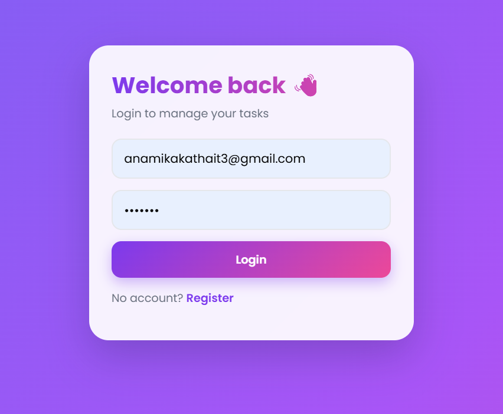
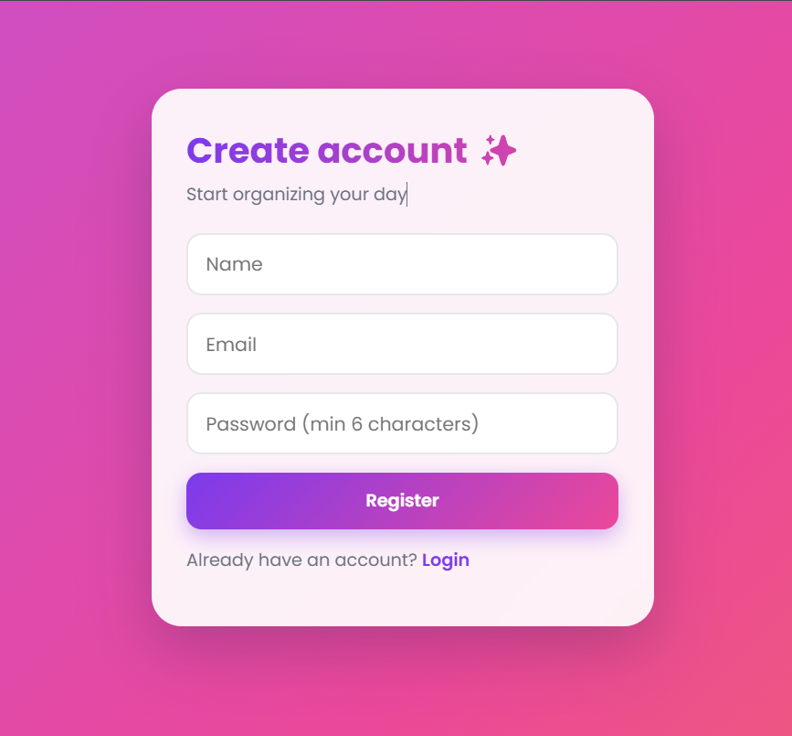
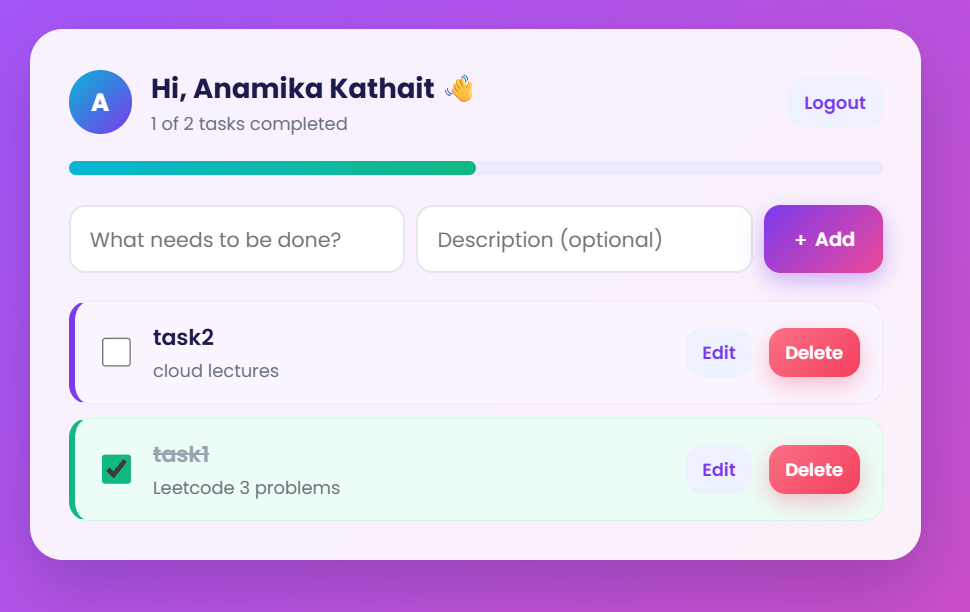

# Task Manager (MERN)

A full stack task manager built with MongoDB, Express, React and Node.js. Users can register, log in, and manage their own private tasks. Every task belongs to one user, and nobody can see or change another user's data.

## Features

- Register and login with JWT authentication
- Passwords hashed with bcrypt
- Create, read, update and delete tasks
- Tick tasks as complete, with a live progress bar
- Inline editing of task title and description
- Each user sees only their own tasks (ownership checks on the backend)
- Input validation on both backend and frontend
- Responsive, colorful UI with a gradient theme

## Screenshots

### Login


### Register


### Task List


## Tech Stack

| Layer | Technology |
|---|---|
| Frontend | React (Vite), React Router, Axios |
| Backend | Node.js, Express |
| Database | MongoDB Atlas with Mongoose |
| Auth | JSON Web Tokens (jsonwebtoken), bcryptjs |
| Validation | validator, Mongoose schema rules |

## Project Structure

```
task-manager/
├── client/                 React frontend
│   └── src/
│       ├── api.js          Axios instance (adds the token automatically)
│       ├── context/        AuthContext (login state)
│       ├── pages/          Login, Register, Tasks
│       ├── App.jsx         Routes and PrivateRoute
│       └── main.jsx        Entry point
├── server/                 Express backend
│   ├── middleware/auth.js  JWT protect middleware
│   ├── models/             User.js, Task.js
│   ├── routes/             auth.js, tasks.js
│   └── server.js           App entry point
└── screenshots/            Images used in this README
```

## Getting Started

### Prerequisites

- Node.js (v18 or newer)
- A free MongoDB Atlas cluster and its connection string

### 1. Clone the repository

```bash
git clone https://github.com/Anamikakathait12/Task-manager.git
cd Task-manager
```

### 2. Set up the backend

```bash
cd server
npm install
```

Create a `server/.env` file:

```
PORT=5000
MONGO_URI=mongodb+srv://<username>:<password>@<cluster>.mongodb.net/taskmanager
JWT_SECRET=use_a_long_random_string_here
```

Start the server:

```bash
npm run dev
```

You should see `MongoDB connected` and `server is running on port 5000`.

### 3. Set up the frontend

Open a second terminal:

```bash
cd client
npm install
npm run dev
```

Open `http://localhost:5173` in your browser.

## Environment Variables

| Variable | Where | Description |
|---|---|---|
| `PORT` | server | Port the API runs on (5000) |
| `MONGO_URI` | server | MongoDB Atlas connection string |
| `JWT_SECRET` | server | Secret used to sign tokens. Keep it private |
| `CLIENT_URL` | server (optional) | Allowed frontend origin for CORS. Defaults to `http://localhost:5173` |
| `VITE_API_URL` | client (optional) | API base URL. Defaults to `http://localhost:5000/api` |

Never commit your `.env` file. It is already listed in `.gitignore`.

## API Endpoints

### Auth

| Method | Endpoint | Description |
|---|---|---|
| POST | `/api/auth/register` | Create an account, returns user info and token |
| POST | `/api/auth/login` | Log in, returns user info and token |

### Tasks (require `Authorization: Bearer <token>`)

| Method | Endpoint | Description |
|---|---|---|
| GET | `/api/tasks` | Get all of the logged-in user's tasks |
| POST | `/api/tasks` | Create a task |
| PATCH | `/api/tasks/:id` | Update a task (partial update) |
| DELETE | `/api/tasks/:id` | Delete a task |

### Example request

```json
POST /api/auth/register
{
  "name": "Anami",
  "email": "anami@test.com",
  "password": "123456"
}
```

## How Authentication Works

1. On register or login, the server returns a JWT that contains the user's id.
2. The frontend saves the token in `localStorage`.
3. An Axios interceptor adds the `Authorization: Bearer <token>` header to every request.
4. The `protect` middleware verifies the token and attaches the user to `req.user`.
5. Task routes filter by `req.user._id`, so users can only access their own tasks.

## Validation Rules

- Name: at least 2 characters
- Email: must be a valid email format
- Password: 6 to 72 characters
- Task title: required, up to 100 characters
- Task description: up to 300 characters

## What I Learned

- Building a REST API with Express and organizing it into routes, models and middleware
- Modeling data and relationships with Mongoose
- Password hashing and JWT-based authentication
- Protecting routes and enforcing ownership on the backend
- React state, effects, context and routing
- Connecting a React frontend to a protected API

## Future Improvements

- Due dates and priorities for tasks
- Search and filter (completed and pending)
- Deployment (Render for the backend, Vercel for the frontend)

## License

This project is for learning purposes.
